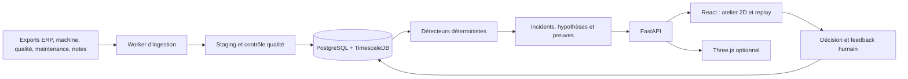
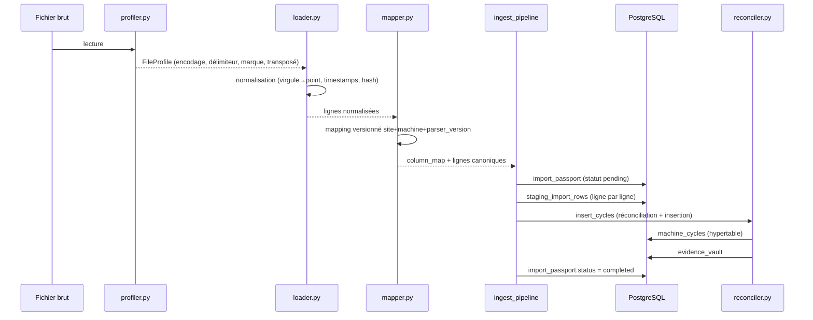
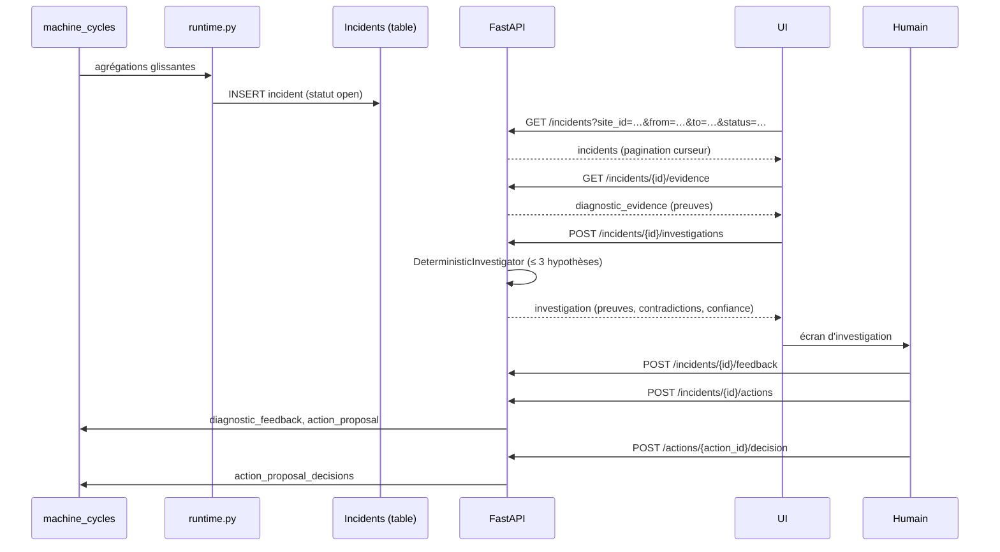

# IDDRV — Wiki du code

> Documentation technique structurée du projet **IDDRV** (Industrial Data
> Ingestion & Reconciliation Vault). Ce wiki décrit l'architecture, les
> modules, les classes et fonctions clés, les dépendances et le mode
> d'emploi. Il est généré à partir de l'état du dépôt au 2026-07-27.

---

## Table des matières

1. [Vue d'ensemble du projet](#1-vue-densemble-du-projet)
2. [Architecture globale](#2-architecture-globale)
3. [Arborescence du dépôt](#3-arborescence-du-dépôt)
4. [Module `ingest/` — Pipeline d'ingestion](#4-module-ingest--pipeline-dingestion)
5. [Module `db/` — Schéma et migrations](#5-module-db--schéma-et-migrations)
6. [Module `backend/` — API FastAPI](#6-module-backend--api-fastapi)
7. [Module `backend/app/diagnostics/` — Moteur de diagnostic](#7-module-backendappdiagnostics--moteur-de-diagnostic)
8. [Module `frontend/` — Application React](#8-module-frontend--application-react)
9. [Module `evals/` — Évaluation du diagnostic](#9-module-evals--évaluation-du-diagnostic)
10. [Module `tests/` — Stratégie de test](#10-module-tests--stratégie-de-test)
11. [Module `scripts/` — Outils d'administration](#11-module-scripts--outils-dadministration)
12. [Dépendances externes](#12-dépendances-externes)
13. [Données, scénarios et contrat canonique EUROMAP](#13-données-scénarios-et-contrat-canonique-euromap)
14. [Cycle de vie d'un import](#14-cycle-de-vie-dun-import)
15. [Cycle de vie d'un incident](#15-cycle-de-vie-dun-incident)
16. [Sécurité, RBAC et isolation multi-site](#16-sécurité-rbac-et-isolation-multi-site)
17. [Configuration et environnement](#17-configuration-et-environnement)
18. [Guide de démarrage rapide](#18-guide-de-démarrage-rapide)
19. [Lancer les tests](#19-lancer-les-tests)
20. [Conventions de contribution](#20-conventions-de-contribution)
21. [Glossaire](#21-glossaire)

---

## 1. Vue d'ensemble du projet

**IDDRV** est une plateforme on-premise d'**ingestion, réconciliation et
diagnostic** de données industrielles pour la plasturgie par injection.
Elle unifie deux grains de données historiquement disjoints :

| Grain   | Source                              | Exemple                              |
| ------- | ----------------------------------- | ------------------------------------ |
| Macro   | ERP (SAP, Divalto, Sylob, GPAO)     | TRS horaire, OF, rebuts par équipe   |
| Micro   | Machines (Arburg, Engel, KM…)       | 1 ligne = 1 cycle d'injection        |

Le système agit comme une **boîte noire de l'atelier** : il détecte un
incident, reconstitue le contexte avant/pendant/après, compare avec une
production saine, classe des hypothèses et expose les preuves permettant
à un humain de décider.

**Cible produit** : supervision et investigation industrielle prête pour un
pilote on-premise. Niveau de maturité déclaré : *prêt pour pilote*, jamais
*validé terrain* avant réception d'un vrai export industriel.

---

## 2. Architecture globale

L'application est un **monolithe modulaire** déployé en quatre services
Docker (cf. [`docker-compose.yml`](file:///Users/soufianehamzaoui/Desktop/EPSI/ProjetSeptembre/docker-compose.yml)).
Redis est conservé comme tampon optionnel mais ne fait pas partie du
chemin critique du pilote.



### Services Docker

| Service        | Responsabilité                                  | Exposition              |
| -------------- | ----------------------------------------------- | ----------------------- |
| `timescaledb`  | PostgreSQL 16 + TimescaleDB, données, migrations | `127.0.0.1:5432`       |
| `redis`        | Tampon streaming / batch                        | `127.0.0.1:6379`        |
| `api`          | FastAPI, authentification, requêtes, diagnostics | Réseau Docker interne   |
| `worker`       | Ingestion manuelle/automatique, détection, reprise | Réseau Docker interne |
| `web`          | Build React et reverse proxy                    | `127.0.0.1:8080` (LAN)  |
| `redis-commander` | UI Redis (profil `dev` uniquement)            | `127.0.0.1:8081`        |

### Flux de données

```
Fichier machine brut
  └─► ingest/profiler.py    → FileProfile (encodage, délimiteur, marque, transposition)
      └─► ingest/loader.py  → List[dict] (lignes normalisées, hash SHA-256)
          └─► ingest/mapper.py → column_map + lignes canoniques (EUROMAP 77/83)
              └─► ingest/ingest_pipeline.py → import_passport (traçabilité)
                  └─► ingest/reconciler.py → machine_cycles → TimescaleDB
```

---

## 3. Arborescence du dépôt

| Répertoire        | Rôle                                                                                  |
| ----------------- | ------------------------------------------------------------------------------------- |
| `backend/`        | API FastAPI, schémas Pydantic, sécurité, repositories et services de diagnostic       |
| `frontend/`       | SPA React + Vite + TypeScript, atelier 2D/3D, tests Vitest                            |
| `ingest/`         | Profilage, mapping, réconciliation, watcher d'ingestion, génération d'échantillons     |
| `db/`             | Schéma SQL initial, migrations, données de référence, script `setup_db.py`             |
| `data/`           | Échantillons unitaires et scénario industriel `industrial_demo` (ground truth)        |
| `evals/`          | Évaluation hors-ligne du moteur de diagnostic (ground truth inaccessible au runtime)  |
| `tests/`          | Tests Python : API, ingestion, diagnostic, sécurité, E2E, UI 3D, UI smoke              |
| `scripts/`        | Administration : sauvegarde, restauration, création admin, garde URL PostgreSQL         |
| `docs/`           | Documentation technique, produit, certification, superpowers, plan orchestré           |
| `docker-compose.yml` | Déploiement local on-premise des quatre services                                    |
| `demo_end_to_end.py` | Démonstration de bout en bout : génération → ingestion → requêtes                  |

---

## 4. Module `ingest/` — Pipeline d'ingestion

Module Python responsable de la transformation des fichiers bruts des
machines et ERP en lignes canoniques prêtes à être insérées dans
PostgreSQL/TimescaleDB.

### 4.1 Vue d'ensemble

| Fichier                                   | Responsabilité                                                                                |
| ----------------------------------------- | --------------------------------------------------------------------------------------------- |
| `ingest/profiler.py`                      | Détection de format (encodage, délimiteur, marque, transposition, ligne d'en-tête)             |
| `ingest/loader.py`                        | Chargement, normalisation des valeurs (virgule→point, horodatage), hash SHA-256                |
| `ingest/mapper.py`                        | Traduction colonnes propriétaires → modèle canonique EUROMAP 77/83                             |
| `ingest/reconciler.py`                    | Réconciliation temporelle ERP ↔ cycles, insertion en base                                     |
| `ingest/ingest_pipeline.py`               | Orchestration complète d'un import (machine, ERP, contexte, scénario)                         |
| `ingest/probe.py`                         | Qualification sans insertion : profil, colonnes reconnues, score de confiance                  |
| `ingest/watcher.py`                       | Surveille `/inbox/{site}/{source}`, gère `inbox → processing → archive` ou `quarantine`       |
| `ingest/structural.py`                    | Profils structurels réutilisables                                                              |
| `ingest/profiler.py` + `ingest/profiles.py` | Catalogue de signatures par marque                                                          |
| `ingest/generate_samples.py`              | Génération d'échantillons pour Arburg, Engel, transposé UTF-16 et ERP XLSX                    |
| `ingest/generate_realistic_scenario.py`   | Génération du scénario `industrial_demo` (sans `ground_truth.json`)                            |
| `ingest/mappers/canonical_dict.json`      | Dictionnaire colonnes propriétaires → canoniques                                              |
| `ingest/mappers/versions/*.json`          | Mappings versionnés par marque et version de parseur                                          |
| `ingest/profiles/*.json`                  | Profils de référence par marque                                                               |

### 4.2 Classes et fonctions clés

#### `ingest/ingest_pipeline.py`

- `ingest_machine_file(file_path, machine_erp_ref, site_id, source_timezone=None)`
  - Pipeline complet d'un fichier machine. Étapes : hash, déduplication,
    résolution de `machine_id` via `resolve_machine_id`, chargement,
    mapping, archivage dans `RAW_STORE`, création de l'import_passport,
    staging, réconciliation, insertion. Statut final `completed` ou
    `failed`. Refuse tout import sans `site_id`.
- `ingest_erp_file(file_path, site_id, source_timezone=None)`
  - Alimente `production_orders` et `shifts` puis déclenche la
    réconciliation. Upserts idempotents. Reprend après interruption en
    supprimant le passeport précédent.
- `ingest_context_file(file_path, kind, site_id, source_timezone=None)`
  - `kind ∈ {quality, maintenance, notes}`. Insère dans
    `quality_checks`, `maintenance_events` ou `operator_notes` avec
    clés stables, traçabilité et gestion des rejets.
- `ingest_scenario(directory, site_id)`
  - Importe dans l'ordre : ERP, machines (152, 1003, 606), qualité,
    maintenance, notes. **`ground_truth.json` n'est jamais lu.**
- `resolve_machine_id(cursor, erp_ref, site_id)`
  - Résout une référence machine ERP vers l'`id` interne, strictement
    isolé par site. Cherche dans `machines` puis dans
    `machine_aliases`. Lève `ValueError` si la référence est ambiguë
    sur le même site.
- `create_import_passport(cursor, file_path, file_hash, profile, col_map, rows, …, site_id)`
  - Insère un passeport d'import avec hash, profil détecté, confiance
    de mapping, comptages et statut. Retourne l'UUID.
- `stage_rows(cursor, passport_id, rows, source_kind, required_time=False)`
  - Trace chaque ligne source dans `staging_import_rows` avec
    `source_line_no`, `source_row_hash` et statut (`accepted` /
    `rejected`). Émet une ligne dans `import_rejections` si applicable.

#### `ingest/reconciler.py`

- `insert_cycles(rows, machine_id, passport_id, site_id)`
  - Insère les cycles en base avec la clé temporelle canonique. Utilise
    la table `machine_cycles` (hypertable TimescaleDB) et matérialise
    les preuves via `evidence_vault`.
- `reconcile_existing_cycles(site_id)`
  - Pour chaque cycle déjà inséré, recherche l'OF ERP actif dans une
    fenêtre ±30 min et calcule `link_confidence` selon l'algorithme
    suivant :
    - 1 OF strict → `1.0`
    - OFs chevauchants → plus récent, `0.6`
    - candidats dans la fenêtre → `1.0 − distance_s / 1800`
    - aucun OF → `0.0` et `production_order_id` NULL
- `get_db_connection()` — Connexion PostgreSQL via `DATABASE_URL`.

#### `ingest/profiler.py`

- `profile_file(path) → FileProfile`
  - Inspecte l'encodage (`chardet`), le délimiteur, la marque
    (Selogica, Gestica, Engel CC300, ERP, …), la ligne d'en-tête et
    l'orientation (transposée ou non).
- `FileProfile` (dataclass) — Attributs : `brand_detected`,
  `encoding`, `delimiter`, `is_transposed`, `header_row`, `columns`.

#### `ingest/loader.py`

- `load_file(path, site_id, machine_erp_ref, source_timezone)`
  - Charge un fichier en `List[dict]` normalisé et applique le mapping
    versionné.
- `compute_file_hash(path) → str` — SHA-256 utilisé pour la
  déduplication.
- `read_erp_trs_xlsx(path)` — Lit un export Excel ERP/TRS via
  `openpyxl`.

#### `ingest/mapper.py`

- `get_mapping_confidence(col_map) → float`
  - Score dans `[0, 1]` basé sur la couverture des colonnes
    canoniques critiques (cycle, dosage, injection, pression, force,
    température, etc.).
- `apply_canonical_map(rows, profile, site_id, machine_erp_ref)`
  - Réécrit les lignes vers les noms de colonnes canoniques.
  - Les colonnes inconnues sont conservées dans `raw_data` (JSONB).

#### `ingest/probe.py`

- Module en lecture seule destiné à qualifier un adaptateur industriel
  sans rien insérer en base. Utilisé par la commande
  `python -m ingest.ingest_pipeline --probe <fichier>`.

#### `ingest/watcher.py`

- Worker d'ingestion surveillant `/inbox/{site}/{source}` via `inotify`
  ou polling.
- Cycle de vie : `inbox → processing → archive` ou `quarantine`.
- Considère un fichier prêt lorsque sa taille et `mtime` sont stables
  pendant `STABLE_SECONDS` (défaut 10 s).
- Trois tentatives avec backoff ; reprise après redémarrage via l'état
  en base ; verrou PostgreSQL pour éviter les traitements concurrents.

### 4.3 Algorithme de réconciliation temporelle

```
Pour chaque cycle machine horodaté :
  1. Rechercher les OFs ERP actifs sur la même machine
     dans une fenêtre ±30 min autour du cycle.
  2. Si 1 OF strictement -> link_confidence = 1.0
  3. Si plusieurs OFs chevauchants -> prendre le plus récent,
     link_confidence = 0.6
  4. Si aucun OF strict mais candidats dans la fenêtre ->
     link_confidence = 1.0 - (distance_s / 1800)
  5. Si aucun OF -> production_order_id = NULL, link_confidence = 0.0
```

---

## 5. Module `db/` — Schéma et migrations

### 5.1 Fichiers

| Fichier                                  | Responsabilité                                                       |
| ---------------------------------------- | -------------------------------------------------------------------- |
| `db/init.sql`                            | Schéma initial : tables, hypertable, index, contraintes, données de référence |
| `db/seed_data.sql`                       | Données de référence (sites, lignes, machines, enums, profils)        |
| `db/migrations/001_…_011_*.sql`          | Migrations idempotentes : multi-site, dataset réaliste, contrat diagnostic, automation, import G7, isolation, scope contexte, invariants, alias scope |
| `db/setup_db.py`                         | Applique `init.sql` + `seed_data.sql` + migrations sur la cible configurée par `DATABASE_URL` |

### 5.2 Tables principales (sélection)

- `sites` — Sites industriels, fuseau horaire.
- `production_lines` — Lignes de production rattachées à un site.
- `machines` — Machines identifiées par `site_id + erp_ref`.
- `machine_aliases` — Alias machines scopés par site.
- `machine_layouts` — Coordonnées pour la vue 2D/3D.
- `production_orders` — OF ERP scopés par `(site_id, id)`.
- `shifts` — Équipes, planifiées par `(machine_id, shift_date, shift_number)`.
- `machine_cycles` — **Hypertable TimescaleDB** ; 1 ligne = 1 cycle.
  Colonnes clés : `time`, `cycle_time_s`, `dosing_time_s`,
  `injection_time_s`, `cooling_time_s`, `cushion_mm`,
  `switchover_pressure_bar`, `switchover_position`,
  `peak_pressure_bar`, `clamp_force_kn`, `mold_open_time_s`,
  `mold_temperature_c`, `good_parts`, `scrap_flag`, `defect_type`,
  `barrel_temp_zone{1..n}_c`, `oil_temperature_c`, `energy_kwh`,
  `data_quality_status`, `part_quality_status`, `link_confidence`,
  `raw_data` (JSONB).
- `machine_cycles_hourly` — **Continuous Aggregate** pour les
  agrégations horaires.
- `import_passports` — Passeports d'import (hash, profil, confiance,
  statut, comptages, `site_id`).
- `staging_import_rows` — Lignes source avec `source_line_no`,
  `source_row_hash`, `status`.
- `import_rejections` — Anomalies détectées lors de l'import.
- `quality_checks` — Contrôles qualité.
- `maintenance_events` — Événements de maintenance.
- `operator_notes` — Notes opérateurs.
- `evidence_vault` — Preuves matérialisées pour le diagnostic.
- `data_quality_issues` — Problèmes de qualité de données.
- `incidents` — Incidents détectés.
- `diagnostic_runs`, `diagnostic_evidence`, `diagnostic_feedback` —
  Investigateur et retour humain.
- `action_proposals`, `action_proposal_decisions` — Propositions
  d'action et décisions.
- `users`, `user_site_roles` — Comptes et RBAC multi-site.
- `sessions` — Sessions de connexion.

### 5.3 Politique de migrations

- Toutes les migrations sont idempotentes (`IF NOT EXISTS`,
  `CREATE OR REPLACE`).
- Les contraintes d'unicité prennent en compte `site_id` pour
  garantir l'isolation multi-site (`(site_id, id)`,
  `(machine_id, shift_date, shift_number)`, etc.).
- Les index temporels sont créés sur les hypertables TimescaleDB.
- L'orchestrateur gèle le contrat DB et OpenAPI avant de paralléliser
  backend et frontend.

---

## 6. Module `backend/` — API FastAPI

### 6.1 Vue d'ensemble

| Fichier                            | Responsabilité                                                      |
| ---------------------------------- | ------------------------------------------------------------------- |
| `backend/app/main.py`              | Instanciation FastAPI, middlewares, gestionnaires d'exception, route `/health` |
| `backend/app/config.py`            | Dataclass `Settings` (immutable) et `settings = Settings.from_env()` |
| `backend/app/db.py`                | Pool de connexions, `check_connection()`                             |
| `backend/app/schemas.py`           | Modèles Pydantic (réponses API, health)                              |
| `backend/app/errors.py`            | Handlers `RequestValidationError`, `HTTPException`, `Exception`      |
| `backend/app/middleware.py`        | `RequestContextMiddleware` (identifiant de requête, latence)        |
| `backend/app/security.py`          | Hash Argon2id, signature de session                                   |
| `backend/app/auth_repository.py`   | Persistance des comptes et sessions                                  |
| `backend/app/repositories.py`      | Accès DB (écritures)                                                |
| `backend/app/read_repositories.py` | Accès DB en lecture (sites, machines, timeline, qualité)            |
| `backend/app/metrics.py`           | Route `/metrics` (Prometheus)                                       |
| `backend/app/api/*.py`             | Routes REST v1                                                       |
| `backend/Dockerfile`               | Image API/worker                                                     |
| `backend/requirements.txt`         | Dépendances Python                                                   |

### 6.2 Routes REST v1

Toutes les routes sont préfixées par `/api/v1` et exposées via
`backend/app/main.py` :

| Module                          | Endpoints                                                                                  |
| ------------------------------- | ------------------------------------------------------------------------------------------ |
| `api/sites.py`                  | `GET /api/v1/sites`, `GET /api/v1/sites/{site_id}/lines`, `GET /api/v1/sites/{site_id}/machines` |
| `api/machines.py`               | `GET /api/v1/machines/{machine_id}/status?as_of=…`, `…/timeline?from=…&to=…&bucket=…`, `…/quality?from=…&to=…` |
| `api/incidents.py`              | `GET /api/v1/incidents?site_id=…&from=…&to=…&status=…`, `GET /api/v1/incidents/{incident_id}`, `GET /api/v1/incidents/{incident_id}/evidence` |
| `api/imports.py`                | `GET /api/v1/imports`, `GET /api/v1/imports/{id}`                                            |
| `api/investigations.py`         | `POST /api/v1/incidents/{incident_id}/investigations`, `GET /api/v1/investigations/{run_id}` |
| `api/actions.py`                | `POST /api/v1/incidents/{incident_id}/actions`, `POST /api/v1/actions/{action_id}/decision` |
| `api/auth.py`                   | `POST /api/v1/auth/login`, `POST /api/v1/auth/logout`, `GET /api/v1/auth/me`                |
| `api/workspace.py`              | Données agrégées pour l'atelier 2D                                                          |
| `metrics.py`                    | `GET /metrics` (Prometheus)                                                                  |
| `main.py`                       | `GET /health` (statut DB)                                                                    |

### 6.3 Règles API

- `as_of`, `from` et `to` sont **obligatoires** pour les données
  historiques.
- **Pagination par curseur** pour incidents et événements.
- **Buckets** autorisés : `minute | hour | shift | order`.
- Aucun endpoint ne retourne les 38 313 cycles bruts sans agrégation.
- Le statut machine distingue `running`, `warning`, `stopped`,
  `offline` et la fraîcheur d'ingestion.
- Tous les repositories reçoivent le **scope site** depuis l'identité
  serveur, jamais depuis un texte libre.

### 6.4 Configuration (`backend/app/config.py`)

`Settings` (dataclass frozen) est instancié une fois via
`Settings.from_env()` :

| Champ                    | Source ENV                | Contraintes                                                   |
| ------------------------ | ------------------------- | ------------------------------------------------------------- |
| `app_name`               | `APP_NAME`                | défaut `IDDVR API`                                            |
| `app_version`            | `APP_VERSION`             | défaut `0.1.0`                                                |
| `database_url`           | `DATABASE_URL`            | obligatoire                                                   |
| `db_connect_timeout_s`   | `DB_CONNECT_TIMEOUT_S`    | ≥ 1, défaut 3                                                 |
| `session_secret`         | `SESSION_SECRET`          | ≥ 32 caractères en `pilot/prod` ; généré aléatoire en dev     |
| `session_ttl_s`          | `SESSION_TTL_S`           | ≥ 300, défaut 28800 (8 h)                                     |
| `session_cookie_name`    | `SESSION_COOKIE_NAME`     | défaut `iddrv_session`                                        |
| `session_cookie_secure`  | `SESSION_COOKIE_SECURE`   | `true` en HTTPS                                               |
| `app_environment`        | `APP_ENV`                 | `development | test | pilot | prod`                          |
| `session_fail_open`      | `SESSION_FAIL_OPEN`       | autorisé uniquement en dev/test                               |
| `allow_anonymous_reads`  | `ALLOW_ANONYMOUS_READS`  | autorisé uniquement en dev/test                               |

L'API **refuse de démarrer** en `pilot/prod` si `SESSION_SECRET` est
absent, trop court ou correspond à un placeholder connu
(`local-development-only-change-me`, `change-this-before-pilot`).

### 6.5 Sécurité

- Hash de mot de passe **Argon2id** (`backend/app/security.py`).
- Cookies `HttpOnly`, `SameSite=Strict`, durée configurable.
- Quatres rôles : `viewer`, `analyst`, `supervisor`, `admin`.
- Sessions/refresh tokens stockés côté serveur.

---

## 7. Module `backend/app/diagnostics/` — Moteur de diagnostic

### 7.1 Vue d'ensemble

| Fichier                          | Responsabilité                                                    |
| -------------------------------- | ----------------------------------------------------------------- |
| `diagnostics/engine.py`          | `DiagnosticEngine` (S001), protocole `Investigator`                |
| `diagnostics/models.py`          | `Evidence`, `Hypothesis`, `InsufficientDataError`, `Investigation`|
| `diagnostics/repository.py`      | `DiagnosticRepository` (accès DB borné pour l'investigateur)     |
| `diagnostics/postgres.py`        | Accès PostgreSQL dédié au diagnostic                              |
| `diagnostics/runtime.py`         | Détection continue d'incidents (fenêtres glissantes)              |

### 7.2 Détecteurs déterministes

- **S001** — Hausse de rebut sur une fenêtre glissante.
- **Dérive abrupte** — Variation rapide d'un paramètre process.
- **Hausse de rebut** — Augmentation soutenue du taux de rebut.
- **Écart de paramètre robuste** — Robust-z sur médiane/MAD.
- **Oscillation de refroidissement** — Instabilité du
  `cooling_time_s` ou `mold_temperature_c`.
- **Proximité d'un événement maintenance/matière** — Corrélation
  temporelle avec `maintenance_events` ou changement de matière.
- **Tendance lente par moule et par OF** — Pente sur fenêtre longue.

### 7.3 Sélection de baseline

Ordre de préférence (du plus précis au plus large) :

1. même machine + produit + moule + matière ;
2. même machine + moule + matière ;
3. même machine + produit ;
4. même machine.

Tailles minimales : **≥ 30 cycles incident** et **≥ 30 cycles
baseline**.

### 7.4 Métriques calculées

Médiane, moyenne, MAD, p05, p95, pente, delta, robust-z.

### 7.5 Preuves

Chaque preuve est matérialisée avec : `source`, `period`, `metric`,
`observation`, `baseline`, `delta`, `unit`, `sample_size`. Toutes les
preuves citées par l'UI proviennent de cette table
`diagnostic_evidence` (et/ou `evidence_vault`).

### 7.6 Investigateur local

- Interface `Investigator` (Protocol) avec
  `DeterministicInvestigator` comme seul provider actif en pilote.
- L'interface `OpenAIInvestigator` est **désactivée** ; elle ne sera
  implémentée que dans la phase différée après retour des quotas.
- Sortie : ≤ 3 hypothèses, avec preuves favorables, contradictions,
  données manquantes, confiance calculée serveur et prochaine
  vérification issue d'une allowlist.
- Texte généré via templates ; **aucune dépendance OpenAI** et
  **aucun appel réseau**.

### 7.7 Règles de confiance

- Fenêtres saines : **faux positifs ≤ 10 %**.
- Données insuffisantes : **abstention ≥ 90 %**.
- Rappel attendu sur l'ensemble des 6 scénarios : **≥ 5/6**.
- Cause attendue **Top-2 sur 6/6** ; **Top-1 sur ≥ 2/3 holdouts**.

### 7.8 Politique `ground_truth.json`

`data/scenarios/industrial_demo/ground_truth.json` est **évaluation
uniquement**. Le runtime, les prompts, les conteneurs, les tables et
les APIs ne lisent jamais ce fichier. Il est consommé exclusivement
par `evals/`.

---

## 8. Module `frontend/` — Application React

### 8.1 Vue d'ensemble

| Répertoire                       | Rôle                                                          |
| -------------------------------- | ------------------------------------------------------------- |
| `frontend/src/main.tsx`          | Point d'entrée, montage de l'application                      |
| `frontend/src/App.tsx`           | Routes, providers (QueryClient, ApiContext, BrowserRouter)    |
| `frontend/src/components/`       | Layout, UI générique (`Ui.tsx`), atelier 2D/3D (`Workshop*`)  |
| `frontend/src/components/three/` | Composants R3F (`InjectionPress`, `WorkshopEnvironment`, palette) |
| `frontend/src/features/showroom/`| Inspection de modèle 3D isolé (showroom)                     |
| `frontend/src/lib/api.ts`        | Client API typé + classes d'erreur (`ApiRequestError`)        |
| `frontend/src/lib/session.ts`    | Gestion de session et diffusion `iddrv:unauthorized`          |
| `frontend/src/pages/`            | Pages routées (login, sites, atelier, incidents, imports, …)  |
| `frontend/src/test/`             | Tests Vitest + Testing Library                               |
| `frontend/src/styles.css`        | Styles globaux                                                |

### 8.2 Routes principales

| Route                                       | Page                              | Rôle                                                              |
| ------------------------------------------- | --------------------------------- | ----------------------------------------------------------------- |
| `/login`                                    | `LoginPage`                       | Authentification (ignorée si `VITE_SKIP_AUTH=true`)               |
| `/overview`                                 | `OverviewPage`                    | Synthèse multi-site                                               |
| `/showroom`                                 | `ShowroomPage`                    | Showroom 3D isolé (présentation)                                  |
| `/workspace`                                | `WorkspacePage`                   | Espace d'investigation transversale                                |
| `/sites`                                    | `SitesPage`                       | Liste des sites industriels                                       |
| `/sites/:siteId/workshop`                   | `WorkshopPage`                    | Atelier 2D avec plan, presse, replay, panneau d'incidents        |
| `/sites/:siteId/opportunities`              | `OpportunitiesPage`               | Opportunités et actions                                           |
| `/incidents`                                | `IncidentsPage`                   | Liste des incidents                                               |
| `/incidents/:incidentId`                    | `IncidentDetailPage`              | Investigation : symptôme, timeline, métriques, hypothèses, preuves |
| `/imports`                                  | `ImportsPage`                     | État des imports (passeports, statuts)                            |
| `/health`                                   | `HealthPage`                      | Statut système (DB, API)                                          |
| `/`                                         | (redirige)                        | `→ /overview`                                                     |
| `*`                                         | (catch-all)                       | `→ /overview`                                                     |

### 8.3 Atelier 2D (`WorkshopPage`)

- Plan 2D en SVG, partagé avec les coordonnées de la future 3D.
- Couleur d'état de chaque presse (`running`, `warning`, `stopped`,
  `offline`).
- OF courant au temps sélectionné, TRS, rebuts, incidents récents.
- **Curseur de replay temporel** ; n'utilise jamais implicitement
  l'heure actuelle sur le dataset historique.
- Écran d'investigation présentant :
  - résumé du symptôme ;
  - timeline synchronisée avant/pendant/après ;
  - métriques comparées à la baseline ;
  - hypothèses, preuves, contre-preuves et données manquantes ;
  - feedback humain et prochaine vérification.

### 8.4 Atelier 3D optionnel

- `VITE_ENABLE_3D=false` par défaut.
- Construit avec `@react-three/fiber` et `@react-three/drei`.
- Caméra top-down, sol simple, presses stylisées, labels et couleurs
  d'état.
- Réutilise les coordonnées `machine_layouts`, le même client API et
  le même panneau latéral que la 2D.
- Maintenu derrière un **feature flag** ; la vue 2D reste le fallback
  complet.

### 8.5 State management

- `@tanstack/react-query` pour la majorité du state serveur.
- `BroadcastChannel` (`lib/session.ts`) pour diffuser les
  invalidations de session (`iddrv:unauthorized`).
- Pas de Redux. Le state UI local vit dans les composants/pages.

### 8.6 Configuration Vite

| Variable          | Effet                                                   |
| ----------------- | ------------------------------------------------------- |
| `VITE_ENABLE_3D`  | Active la vue Three.js                                  |
| `VITE_SKIP_AUTH`  | Désactive l'écran de login (mode démo / test)           |

### 8.7 Tests frontend

- Vitest + Testing Library : `api.test.ts`, `app.test.tsx`,
  `session.test.ts`, `showroom.test.tsx`, `workshop3d.test.ts`.
- `tests/ui_smoke.py` et `tests/ui_3d_smoke.py` automatisent la
  vérification du parcours via Playwright.

---

## 9. Module `evals/` — Évaluation du diagnostic

- `evals/evaluate_diagnostics.py` charge un scénario
  (`data/scenarios/industrial_demo/`) avec son `ground_truth.json`.
- Les **scénarios S001, S005, S006** sont utilisés en développement.
- Les **scénarios S002, S003, S004** sont conservés en *holdout* jusqu'à
  la recette.
- Critères évalués : rappel (≥ 5/6), Top-2 (6/6), Top-1 sur ≥ 2/3
  holdouts, taux d'abstention, taux de faux positifs, citations de
  preuves valides.
- **`ground_truth.json` n'est jamais lu par le runtime**, ni par les
  prompts, conteneurs, tables ou APIs. L'évaluation est strictement
  isolée dans `evals/`.

---

## 10. Module `tests/` — Stratégie de test

### 10.1 Tests Python (`pytest`)

| Fichier                                   | Couverture                                                                |
| ----------------------------------------- | ------------------------------------------------------------------------- |
| `tests/test_backend_api_contract.py`      | Contrat OpenAPI, RBAC, pagination, isolation site                         |
| `tests/test_backend_auth_hardening.py`    | Sécurité des sessions, cookies, brute-force, fail-open                    |
| `tests/test_backend_monitoring.py`        | Endpoints de santé et métriques                                           |
| `tests/test_backend_skeleton.py`          | Squelette FastAPI, configuration, erreurs                                 |
| `tests/test_diagnostics_runtime.py`       | Détecteurs déterministes et investigateur                                 |
| `tests/test_diagnostic_evaluation.py`     | Évaluation hors-ligne vs `ground_truth.json`                              |
| `tests/test_diagnostics_s001.py`          | Cas spécifique S001                                                       |
| `tests/test_ingest_g5.py`                 | Worker d'ingestion (watcher, archive, quarantaine)                        |
| `tests/test_ingestion.py`                 | Pipeline d'ingestion (profiler, mapper, loader, reconciler)               |
| `tests/test_loader_runtime_mapping.py`    | Chargement + mapping versionné                                            |
| `tests/test_pg_url_guard.py`              | Garde-fou URL PostgreSQL (mots de passe, routage)                         |
| `tests/test_probe_privacy.py`             | Le mode `probe` n'insère rien et n'exfiltre pas de données                |
| `tests/test_realistic_dataset.py`         | Chargement du dataset `industrial_demo`                                    |
| `tests/test_reconciler_flags.py`          | Scoring de réconciliation                                                 |
| `tests/test_reconciler_quality.py`        | Réconciliation vs qualité des données                                     |
| `tests/test_reconciler_source_values.py`  | Réconciliation vs valeurs source                                          |
| `tests/test_site_isolation.py`            | Isolation multi-site stricte                                              |
| `tests/test_structural_profiles.py`       | Profils structurels d'ingestion                                            |
| `tests/test_hardening_regressions.py`     | Régressions sécurité/durcissement                                          |

### 10.2 Tests E2E (`tests/e2e/`)

- `run_tests.py --tier 1,2` — runner officiel.
- `test_cases/` : `test_db_load.py`, `test_mapper.py`,
  `test_profiler.py`, `test_reconcile.py`, `test_schema_init.py`.
- Cibles : PostgreSQL local `iddrv_test` et Redis local DB 1, **avec
  confirmation explicite** :
  ```dotenv
  E2E_DATABASE_URL=postgresql://<user>:<encoded-pwd>@localhost:5432/iddrv_test
  E2E_DESTRUCTIVE_CLEANUP_CONFIRMATION=iddrv_test:truncate-and-redis-1:flush
  ```
- Le runner refuse toute autre cible, les paramètres de routage dans
  les URL et une base dépourvue de sentinelle E2E.

### 10.3 Commandes de référence

```bash
python -m pytest -q
python tests/e2e/run_tests.py --tier 1,2
docker compose config
docker compose up -d --build
npm --prefix frontend run lint
npm --prefix frontend run test
npm --prefix frontend run build
npm --prefix frontend run test:e2e
```

---

## 11. Module `scripts/` — Outils d'administration

| Script                       | Rôle                                                                       |
| ---------------------------- | -------------------------------------------------------------------------- |
| `scripts/create_admin.py`    | Création du premier compte `admin` (bootstrap)                            |
| `scripts/backup.sh`          | Sauvegarde on-prem : `pg_dump` + archive `data/raw`                        |
| `scripts/restore.sh`         | Restauration à partir d'une sauvegarde validée                             |
| `scripts/pg_url_guard.py`    | Vérifie qu'une URL PostgreSQL est sûre (encodage, hôte, paramètres)        |

`scripts/pg_url_guard.py` est notamment testé par
`tests/test_pg_url_guard.py` pour garantir que les mots de passe
contenant des caractères réservés ne sont pas perdus ou réinterprétés.

---

## 12. Dépendances externes

### 12.1 Python (`requirements.txt` racine et `backend/requirements.txt`)

| Paquet             | Usage                                                         |
| ------------------ | ------------------------------------------------------------- |
| `psycopg2-binary`  | Connexion PostgreSQL                                          |
| `pandas`           | Chargement CSV/XLSX                                           |
| `openpyxl`         | Lecture des fichiers Excel `.xlsx`                            |
| `chardet`          | Détection automatique d'encodage                              |
| `fastapi`          | Framework API                                                 |
| `uvicorn`          | Serveur ASGI                                                  |
| `pydantic`         | Validation de schémas                                         |
| `pytest`           | Tests                                                          |
| `argon2-cffi`      | Hash de mots de passe                                          |
| `prometheus_client`| Export de métriques                                           |

### 12.2 Frontend (`frontend/package.json`)

| Paquet                 | Usage                                                  |
| ---------------------- | ------------------------------------------------------ |
| `react`, `react-dom`   | UI                                                    |
| `react-router-dom`     | Routage                                               |
| `@tanstack/react-query`| State serveur                                          |
| `@react-three/fiber`   | Vue 3D                                                 |
| `@react-three/drei`    | Helpers R3F                                            |
| `echarts`              | Graphiques                                             |
| `vitest`               | Tests unitaires                                        |
| `@testing-library/react`| Tests de composants                                   |
| `eslint`               | Lint                                                   |

### 12.3 Infrastructure (Docker)

| Image                              | Version           | Rôle                |
| ---------------------------------- | ----------------- | ------------------- |
| `timescale/timescaledb`            | `2.28.2-pg16`     | Base de données     |
| `redis`                            | `7-alpine`        | Tampon              |
| `ghcr.io/joeferner/redis-commander` | `latest`          | UI Redis (profil `dev`) |
| Build `backend/Dockerfile`         | —                 | API / worker        |
| Build `frontend/Dockerfile`        | —                 | Web (nginx)         |

---

## 13. Données, scénarios et contrat canonique EUROMAP

### 13.1 Modèle canonique EUROMAP 77/83 (table `machine_cycles`)

| Champ canonique              | Type SQL          | Unité | Description                                |
| ---------------------------- | ----------------- | ----- | ------------------------------------------ |
| `time`                       | TIMESTAMPTZ       | —     | Horodatage du cycle (clé temporelle)        |
| `cycle_time_s`               | NUMERIC(7,3)      | s     | Temps de cycle total                       |
| `dosing_time_s`              | NUMERIC(7,3)      | s     | Temps de dosage/plastification             |
| `injection_time_s`           | NUMERIC(7,3)      | s     | Temps d'injection                          |
| `cooling_time_s`             | NUMERIC(7,3)      | s     | Temps de refroidissement                   |
| `cushion_mm`                 | NUMERIC(6,3)      | mm/cm3| Coussin matière                            |
| `switchover_pressure_bar`    | NUMERIC(8,2)      | bar   | Pression de commutation                    |
| `switchover_position`        | NUMERIC(6,3)      | mm    | Position de commutation                    |
| `peak_pressure_bar`          | NUMERIC(8,2)      | bar   | Pression de pic                            |
| `clamp_force_kn`             | NUMERIC(8,2)      | kN    | Force de fermeture                         |
| `mold_open_time_s`           | NUMERIC(7,3)      | s     | Temps d'ouverture moule                     |
| `mold_temperature_c`         | NUMERIC(6,2)      | °C    | Température moule                           |
| `good_parts`                 | SMALLINT          | pièces| Bonnes pièces (0 ou 1)                      |
| `scrap_flag`                 | BOOLEAN           | —     | Indicateur de rebut                         |
| `defect_type`                | VARCHAR           | —     | `short_shot`, `flash`, `warpage`, …        |
| `barrel_temp_zone{1..n}_c`   | NUMERIC(6,2)      | °C    | Température fourreau zones 1..n             |
| `oil_temperature_c`          | NUMERIC(6,2)      | °C    | Température huile hydraulique               |
| `energy_kwh`                 | NUMERIC           | kWh   | Énergie par cycle                           |
| `link_confidence`            | NUMERIC(4,3)      | 0–1   | Confiance de réconciliation ERP             |
| `data_quality_status`        | VARCHAR           | —     | `valid` / `suspect` / `outlier` / `sensor_error` |
| `part_quality_status`        | VARCHAR           | —     | `good` / `scrap` / `unknown`               |
| `raw_data`                   | JSONB             | —     | Colonnes non mappées (données brutes)       |

### 13.2 Formats de fichiers supportés

| Format                          | Encodage       | Délimiteur | Orientation   | Marque cible               |
| ------------------------------- | -------------- | ---------- | ------------- | -------------------------- |
| `.txt` (Selogica/Gestica)       | UTF-8 / Latin-1| `;`        | Standard      | Arburg Allrounder          |
| `.csv` (CC300)                  | UTF-8          | `,`        | Standard      | Engel                      |
| `.txt` (tubes, transposé)       | UTF-16 LE + BOM| `\t`       | Transposée    | Presses tuyaux             |
| `.xlsx` (ERP/TRS)               | Excel          | n/a        | Standard      | Divalto, SAP, Sylob, GPAO  |

### 13.3 Scénario `industrial_demo`

- Localisation : `data/scenarios/industrial_demo/`.
- Contenu :
  - `erp_orders.xlsx`
  - `machine_cycles_152.csv`, `machine_cycles_1003.csv`,
    `machine_cycles_606.csv`
  - `quality_checks.csv`
  - `maintenance_events.csv`
  - `operator_notes.csv`
  - `ground_truth.json` — **réservé à `evals/`**
- Volume cible : 60 OF, 38 313 cycles, 408 contrôles, 12 maintenances
  et 10 notes.
- Le scénario est qualifié par les détecteurs S001, S005, S006 ;
  S002, S003, S004 sont en *holdout*.

---

## 14. Cycle de vie d'un import



États possibles d'un passeport : `pending`, `completed`, `failed`.
Aucun passeport ne reste `pending` après la fin d'un job.

---

## 15. Cycle de vie d'un incident



---

## 16. Sécurité, RBAC et isolation multi-site

### 16.1 Authentification

- Comptes locaux (`users`, `user_site_roles`).
- Hash de mot de passe **Argon2id**.
- Cookies `HttpOnly`, `SameSite=Strict`.
- Durée de session configurable via `SESSION_TTL_S`.
- Le serveur vérifie la présence et la robustesse de `SESSION_SECRET`
  en `pilot/prod`.

### 16.2 Rôles

| Rôle         | Droits                                                                 |
| ------------ | ---------------------------------------------------------------------- |
| `viewer`     | Lecture                                                                |
| `analyst`    | Lecture + lancer un diagnostic + commenter                             |
| `supervisor` | Lecture + valider/rejeter une proposition d'action                     |
| `admin`      | Gestion des comptes, sites, lignes et configuration                    |

### 16.3 Isolation multi-site

- Chaque entité métier est rattachée à un `site_id`.
- Toutes les références (OF, machine, shift, evidence, incident) sont
  scopées par site.
- Les repositories reçoivent le **scope site depuis l'identité
  serveur**, jamais depuis un texte libre.
- Les tests `test_site_isolation.py` et `test_backend_api_contract.py`
  vérifient l'absence de fuite inter-site.

### 16.4 Garde-fous `pg_url_guard`

- Refus des URL avec paramètres de routage ambigus.
- Refus des mots de passe non encodés contenant des caractères
  réservés.
- Refus d'une base sans sentinelle E2E pour les tests destructifs.

---

## 17. Configuration et environnement

### 17.1 Variables d'environnement (`.env`)

| Variable                  | Défaut               | Description                                                  |
| ------------------------- | -------------------- | ------------------------------------------------------------ |
| `DATABASE_URL`            | requis               | URL PostgreSQL locale complète pour les scripts hôte         |
| `DOCKER_DATABASE_URL`     | requis               | URL PostgreSQL côté conteneur (hôte `timescaledb`)          |
| `POSTGRES_DB`             | `iddrv`              | Nom de la base (Docker)                                      |
| `POSTGRES_USER`           | `iddrv_user`         | Utilisateur PostgreSQL (Docker)                              |
| `POSTGRES_PASSWORD`       | requis               | Mot de passe PostgreSQL (Docker)                             |
| `REDIS_URL`               | `redis://redis:6379/0` | Connexion Redis                                            |
| `APP_ENV`                 | `development`        | `development | test | pilot | prod`                        |
| `ALLOW_ANONYMOUS_READS`   | `false`              | Lecture anonyme (dev/test uniquement)                        |
| `SESSION_SECRET`          | vide (auto dev)      | ≥ 32 caractères en `pilot/prod`                              |
| `SESSION_TTL_S`           | `28800`              | TTL session (8 h)                                            |
| `SESSION_COOKIE_NAME`     | `iddrv_session`      | Nom du cookie                                                |
| `SESSION_COOKIE_SECURE`   | `false`              | `true` en HTTPS                                              |
| `INBOX_ROOT`              | `/var/lib/iddrv/inbox` | Répertoire surveillé                                       |
| `ARCHIVE_ROOT`            | `/var/lib/iddrv/archive` | Répertoire d'archive                                     |
| `QUARANTINE_ROOT`         | `/var/lib/iddrv/quarantine` | Répertoire de quarantaine                              |
| `RAW_STORE_PATH`          | `/var/lib/iddrv/raw` | Archivage fichiers bruts                                     |
| `WATCH_INTERVAL_S`        | `5`                  | Polling du watcher                                            |
| `STABLE_SECONDS`          | `10`                 | Fichier stable avant pickup                                  |
| `WEB_BIND_ADDRESS`        | `127.0.0.1`          | Adresse d'exposition du web                                   |
| `WEB_PORT`                | `8080`               | Port d'exposition du web                                      |
| `VITE_ENABLE_3D`          | `false`              | Active la vue Three.js                                        |
| `VITE_SKIP_AUTH`          | `false`              | Désactive l'écran de login                                    |
| `E2E_DATABASE_URL`        | —                    | Base de test E2E dédiée                                       |
| `E2E_DESTRUCTIVE_CLEANUP_CONFIRMATION` | —      | Sentinelle explicite pour la destruction E2E                  |

### 17.2 Politique de secrets

- Aucun mot de passe n'est commité ; `.env` est local et non versionné.
- Les caractères réservés du mot de passe doivent être encodés dans
  les URL PostgreSQL.
- Le `SESSION_SECRET` est strictement vérifié en `pilot/prod`.

---

## 18. Guide de démarrage rapide

### 18.1 Prérequis

| Outil                   | Version minimale | Rôle                                |
| ----------------------- | ---------------- | ----------------------------------- |
| Docker + Compose        | 24.x             | Héberge PostgreSQL, TimescaleDB, Redis |
| Python                  | 3.11+            | Scripts d'ingestion et API          |
| pip                     | 23.x             | Gestionnaire de paquets             |
| Node.js                 | 20.x (LTS)       | Build et dev frontend                |

### 18.2 Installation

```bash
# 1. Cloner le dépôt
git clone <url-du-repo> && cd ProjetSeptembre

# 2. Préparer l'environnement
cp .env.example .env
# Éditer .env : POSTGRES_PASSWORD, SESSION_SECRET, DOCKER_DATABASE_URL

# 3. Installer les dépendances Python
python -m venv .venv && source .venv/bin/activate
pip install -r requirements.txt

# 4. Démarrer les services
docker compose up -d timescaledb redis
# (API, worker et web peuvent être lancés par la suite)
```

### 18.3 Initialisation de la base

```bash
python db/setup_db.py
```

`setup_db.py` applique `init.sql`, `seed_data.sql` puis toutes les
migrations de `db/migrations/`.

### 18.4 Démonstration de bout en bout

```bash
python demo_end_to_end.py
```

Génère 4 fichiers exemples, ingère 3 fichiers machine, affiche un
résumé (cycles/machine, TRS, anomalies, comparaison ERP vs machine).

### 18.5 Import du scénario industriel

```bash
python -m ingest.import_scenario data/scenarios/industrial_demo --site-id 1
# ou
python -m ingest.ingest_pipeline --scenario data/scenarios/industrial_demo 1
```

### 18.6 Démarrage complet (on-prem)

```bash
docker compose up -d --build
# API : http://localhost:8000
# Web : http://localhost:8080
# Health : http://localhost:8000/health
```

### 18.7 Création du premier admin

```bash
docker compose exec api python scripts/create_admin.py
```

---

## 19. Lancer les tests

### 19.1 Tests unitaires Python

```bash
python -m pytest -q
```

### 19.2 Tests E2E

```bash
# Configuration explicite (voir AGENTS.md)
export E2E_DATABASE_URL=postgresql://<user>:<encoded-pwd>@localhost:5432/iddrv_test
export E2E_DESTRUCTIVE_CLEANUP_CONFIRMATION=iddrv_test:truncate-and-redis-1:flush

python tests/e2e/run_tests.py --tier 1,2
```

### 19.3 Tests frontend

```bash
npm --prefix frontend run lint
npm --prefix frontend run test
npm --prefix frontend run build
npm --prefix frontend run test:e2e
```

### 19.4 Vérification Docker

```bash
docker compose config --quiet
```

---

## 20. Conventions de contribution

### 20.1 Propriété des fichiers

| Agent                       | Périmètre exclusif                                                            |
| --------------------------- | ----------------------------------------------------------------------------- |
| `iddrv_data_worker`         | `db/`, `ingest/`, tests data explicitement assignés                            |
| `iddrv_backend_worker`      | `backend/`, sauf `backend/app/diagnostics/`                                   |
| `iddrv_frontend_worker`     | `frontend/`                                                                    |
| `iddrv_diagnostic_worker`   | `backend/app/diagnostics/`, tests diagnostic, `evals/`                          |
| `iddrv_explorer`            | Lecture seule                                                                  |
| `iddrv_reviewer`            | Lecture seule                                                                  |
| Orchestrateur               | Manifests racine, `docker-compose.yml`, `.codex/`, `AGENTS.md`, contrats, Git |

### 20.2 Règles de modification

- Travailler **uniquement** dans le périmètre déclaré.
- Préserver le travail utilisateur et les changements non liés.
- Ne jamais exécuter de commandes Git destructrices ni supprimer de
  volumes Docker.
- Ne **jamais** commit, push, ni réécrire l'historique. Git appartient
  à l'orchestrateur.
- Utiliser `apply_patch` pour les modifications manuelles.
- Garder les secrets hors du dépôt.
- Ne **jamais** ajouter de dépendance OpenAI ni effectuer d'appel
  OpenAI avant l'activation explicite de la phase différée.
- **`ground_truth.json` est évaluation uniquement** ; le runtime ne
  doit jamais le lire.

### 20.3 Ajouter le support d'une nouvelle marque

1. Ajouter les **signatures** dans `ingest/profiler.py`.
2. Enrichir le **dictionnaire** `ingest/mappers/canonical_dict.json`
   (ou créer un mapping versionné dans
   `ingest/mappers/versions/`).
3. Créer un **fichier d'exemple** via `ingest/generate_samples.py`.
4. Ajouter un **test** dans `tests/test_ingestion.py`.

### 20.4 Ajouter un champ canonique

1. Ajouter la colonne dans `db/init.sql` (et créer une migration).
2. Ajouter l'entrée dans `ingest/mappers/canonical_dict.json`.
3. Mettre à jour `ingest/reconciler.py` (INSERT statement).
4. Ajouter un test couvrant le nouveau champ.

### 20.5 Definition of Done globale

1. Les six gates G1–G6 sont verts avec preuves enregistrées.
2. Le dataset réaliste complet est requêtable depuis l'API, jamais
   directement depuis les CSV par le frontend.
3. Les six scénarios sont évalués automatiquement sans fuite du
   ground truth.
4. L'interface 2D suffit pour exploiter le produit ; la 3D reste
   optionnelle.
5. Les rôles et l'isolation multi-site sont prouvés.
6. L'ingestion automatique est idempotente et récupérable après
   incident.
7. Le déploiement on-prem se reconstruit, se sauvegarde et se restaure.
8. Aucun agent de développement n'a travaillé hors ownership ni créé
   de commit.
9. Chaque commit correspond à un gate validé et peut être revert
   indépendamment.
10. La documentation ne revendique pas de validation terrain avant test
    d'un vrai export.

---

## 21. Glossaire

| Terme                  | Définition                                                                                       |
| ---------------------- | ------------------------------------------------------------------------------------------------ |
| **IDDRV**              | Industrial Data Ingestion & Reconciliation Vault — nom du projet.                                |
| **TRS**                | Taux de Rendement Synthétique (indicateur OEE).                                                  |
| **OF**                 | Ordre de Fabrication.                                                                             |
| **Cycle**              | Un cycle d'injection (grain le plus fin, ~15 à 60 s).                                            |
| **EUROMAP 77 / 83**    | Normes d'interface machine-MES et de plasturgie injection servant de modèle canonique.            |
| **Hypertable**         | Table TimescaleDB partitionnée automatiquement par temps.                                        |
| **Continuous Aggregate**| Vue agrégée TimescaleDB rafraîchie en continu (ex. `machine_cycles_hourly`).                      |
| **Passeport d'import** | Enregistrement `import_passports` traçant chaque import (hash, profil, confiance, statut).       |
| **`link_confidence`**  | Score `[0,1]` issu de la réconciliation temporelle ERP ↔ cycle.                                  |
| **Baseline**           | Distribution de référence pour un contexte (machine + produit + moule + matière).               |
| **Robust-z**           | Z-score basé sur médiane et MAD, résistant aux outliers.                                        |
| **Holdout**            | Scénario réservé pour la recette (S002, S003, S004).                                             |
| **Probe**              | Mode qualification sans insertion en base (cf. `ingest/probe.py`).                                |
| **Inbox / Archive / Quarantine** | États successifs d'un fichier observé par le worker d'ingestion.                       |
| **Pilot**              | Mode `APP_ENV=pilot` ; impose un `SESSION_SECRET` fort et refuse le `fail_open`.                 |
| **Ground truth**       | Fichier `ground_truth.json` réservé à l'évaluation (`evals/`), jamais lu par le runtime.         |

---

*Wiki du code IDDRV — généré pour faciliter la prise en main du
dépôt. Pour toute modification, mettre à jour le plan orchestré
(`docs/orchestrated-implementation-plan.md`) et l'état d'implémentation
(`docs/implementation-status.md`) avant d'éditer ce wiki.*
