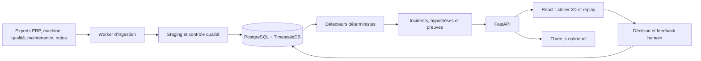

# IDDRV — Plan d'implémentation orchestré

## 1. Décisions figées

Ce document constitue le plan exécutable pour transformer le socle IDDRV en application de supervision et d'investigation industrielle prête à être qualifiée en pilote.

### État du plan

- **Exécution active** : le quota a été réinitialisé et les gates sont exécutés par vagues Luna.
- Aucun agent ne crée de commit ; l'orchestrateur valide les handoffs et les tests.
- L'intégration OpenAI de l'agent applicatif est reportée à une phase ultérieure.
- Le premier pilote fonctionne entièrement avec un moteur de diagnostic déterministe local.

### Cible produit

Le produit est une **boîte noire de l'atelier** : il détecte un incident, reconstitue le contexte avant/pendant/après, compare avec une production saine, classe des hypothèses et expose les preuves permettant à un humain de décider.

### Contraintes retenues

- Horizon : **6 semaines**.
- Niveau : **prêt pour pilote**, mais pas déclaré validé terrain avant réception d'un vrai export industriel.
- Déploiement : **on-premise avec Docker Compose**.
- Backend : **FastAPI**, Python 3.13, PostgreSQL/TimescaleDB.
- Frontend : **React + Vite + TypeScript**.
- Vue 2D principale ; vue Three.js légère derrière un feature flag.
- Comptes locaux avec rôles `viewer`, `analyst`, `supervisor`, `admin`.
- Commits Git uniquement par l'orchestrateur, à chaque gate validé.
- Ancien dossier `.agents/` conservé comme historique, mais jamais utilisé comme source d'état.

## 2. Architecture cible

Le système reste un **monolithe modulaire** déployé en quatre services. Redis reste optionnel et ne fait pas partie du chemin critique du pilote.



### Services Docker

| Service | Responsabilité | Exposition |
|---|---|---|
| `db` | PostgreSQL 16, TimescaleDB, données et migrations | Réseau Docker uniquement |
| `api` | FastAPI, authentification, requêtes et diagnostics | Réseau Docker uniquement |
| `worker` | Ingestion manuelle/automatique, détection et reprise | Réseau Docker uniquement |
| `web` | Build React et reverse proxy | Seul service exposé sur le LAN |

### Arborescence cible

```text
backend/
  app/
    api/              # routes FastAPI v1
    auth/             # comptes, sessions et RBAC
    repositories/     # accès DB
    services/         # statut, timeline, qualité, incidents
    diagnostics/      # baselines, détecteurs, preuves, investigateur local
    worker/           # watcher, jobs, retries, archive/quarantaine
  tests/
frontend/
  src/
    api/
    auth/
    features/workshop/
    features/incidents/
    features/imports/
    features/view3d/
db/
  migrations/
ingest/               # parseurs existants maintenus et durcis
evals/
  fixtures/           # ground truth inaccessible au runtime
  tests/
```

## 3. Orchestration Codex après le reset des quotas

### Politique de modèles

- Orchestrateur principal : `gpt-5.6-sol`, effort `ultra`.
- Tous les sous-agents : `gpt-5.6-luna`.
- Profondeur maximale : `1` ; aucun agent ne peut créer ses propres sous-agents.
- Quatre threads maximum, soit l'orchestrateur et au plus trois agents actifs.
- Les agents Luna sont définis dans `.codex/agents/*.toml`, comme permis par la configuration d'agents personnalisés de Codex.

Configuration projet attendue :

```toml
[agents]
max_threads = 4
max_depth = 1
job_max_runtime_seconds = 1800
interrupt_message = true
```

### Profils d'agents

| Agent | Modèle / effort | Droits | Propriété exclusive |
|---|---|---|---|
| `iddrv_explorer` | Luna `low` | lecture seule | cartographie, analyse, aucun changement |
| `iddrv_data_worker` | Luna `medium` | workspace-write | `db/`, `ingest/`, tests data |
| `iddrv_backend_worker` | Luna `medium` | workspace-write | `backend/` hors diagnostics data |
| `iddrv_frontend_worker` | Luna `medium` | workspace-write | `frontend/` |
| `iddrv_diagnostic_worker` | Luna `high` | workspace-write | `backend/app/diagnostics/`, `evals/` |
| `iddrv_reviewer` | Luna `high` | lecture seule | revue transversale et rapport de findings |

Chaque profil doit imposer : pas de commit, pas de commande destructrice, pas de changement hors périmètre, tests obligatoires et handoff structuré.

### Règles anti-collision

1. L'orchestrateur possède seul les manifests racine, `docker-compose.yml`, `.codex/`, `AGENTS.md`, les contrats partagés et Git.
2. Deux agents en écriture ne travaillent jamais sur le même répertoire pendant une vague.
3. Les contrats DB/OpenAPI sont figés par l'orchestrateur avant de paralléliser backend et frontend.
4. Les reviewers restent en lecture seule.
5. Les changements partagés sont intégrés entre deux vagues, jamais pendant une vague.
6. Un agent remet son travail avant qu'un successeur dépendant soit lancé.

### Contrat de mission envoyé à chaque agent

```text
Objectif unique :
Périmètre de fichiers autorisé :
Contrats à respecter :
Dépendances déjà disponibles :
Changements interdits :
Tests obligatoires :
Critère PASS :
Format du handoff : résultat, fichiers, tests, risques, blocages.
```

### Cycle d'une vague

1. L'orchestrateur vérifie que le gate précédent est vert.
2. Il fige les contrats et donne un périmètre non chevauchant à chaque agent.
3. Les agents exécutent en parallèle, au maximum trois.
4. Ils rendent leur handoff sans commit.
5. L'orchestrateur inspecte le diff et exécute les tests transversaux.
6. Le reviewer cherche les régressions, failles et preuves manquantes.
7. L'orchestrateur corrige ou renvoie une mission étroite.
8. Lorsque le gate est vert, l'orchestrateur crée le commit du jalon.

### Gestion des échecs

- Premier échec : relancer le même agent avec la cause et une mission réduite.
- Deuxième échec identique : l'orchestrateur diagnostique et réécrit le contrat.
- Troisième échec : arrêter la vague et demander une décision humaine ; ne pas contourner le gate.
- Agent bloqué plus de 30 minutes : demander un handoff partiel, interrompre, puis réassigner uniquement le reliquat.
- Capacité modèle indisponible : attendre le quota/capacité ; ne pas basculer silencieusement vers un autre modèle.

## 4. Gate 0 — Préparation et sécurité Git

### Responsable

Orchestrateur uniquement.

### Travaux

1. Vérifier l'état du dépôt et s'assurer qu'aucun changement utilisateur n'est perdu.
2. Créer un premier commit de référence sur `main`, puisque le dépôt n'a actuellement aucun commit.
3. Créer la branche `codex/iddrv-pilot`.
4. Ajouter `AGENTS.md`, `.codex/config.toml` et les profils Luna.
5. Créer un unique suivi `docs/implementation-status.md`; ne pas recréer une arborescence de rapports par agent.
6. Documenter les commandes de test, les zones de propriété et les interdictions.
7. Lancer un smoke test en lecture seule pour chaque profil et vérifier que le modèle actif est Luna.

### Gate G0

- Commit de référence présent.
- Branche de travail créée.
- Profils chargés sans erreur avec `codex --strict-config`.
- Trois agents maximum peuvent être lancés ; aucun ne peut déléguer davantage.
- Test d'écriture hors périmètre refusé par les instructions/revue.

## 5. Semaine 1 — Dataset réaliste intégral en base

### Vague 1A — Schéma et sémantique

**Agent Data**

- Ajouter `production_lines`, `quality_checks`, `maintenance_events`, `operator_notes` et `machine_layouts`.
- Rattacher toutes les entités métier à `site_id` ; utiliser `(site_id, id)` pour rendre les références d'OF isolées par site.
- Ajouter `line_id` aux machines.
- Étendre `machine_cycles` avec `cooling_time_s`, `mold_temperature_c`, `energy_kwh` et les températures nécessaires.
- Remplacer l'ambiguïté `quality_flag` par :
  - `data_quality_status` : validité technique de la mesure ;
  - `part_quality_status` : `good | scrap | unknown` ;
  - `defect_type` : `short_shot`, `flash`, `warpage`, etc.
- Corriger le décalage de paramètres dans `insert_cycles`, notamment `injection_time_s`.
- Corriger la conversion de `good_part` vers un entier cohérent.
- Ajouter les index temporels et les contraintes d'unicité nécessaires à l'idempotence.

**Agent Backend**, en parallèle après gel du schéma

- Créer le squelette FastAPI, configuration, connexion DB, erreurs communes et endpoint `/health`.
- Définir les schémas de réponse Pydantic à partir du contrat OpenAPI figé, sans logique métier.

**Agent Frontend**, en parallèle

- Initialiser React/Vite/TypeScript.
- Installer React Router, TanStack Query, ECharts et les dépendances de test.
- Construire le shell, la navigation et un client API mocké.

### Vague 1B — Import complet

**Agent Data**

- Créer une commande unique :

```bash
python -m ingest.import_scenario data/scenarios/industrial_demo --site-id 1
```

- Importer dans cet ordre : machines/lignes, ERP, cycles, qualité, maintenance, notes.
- Utiliser staging puis chargement en lot (`COPY`) pour les 38 313 cycles.
- Conserver les fichiers bruts, hash, numéro de ligne, statut et erreur.
- Rejouer un fichier par hash et `source_row_hash` sans doublon.
- Marquer chaque passeport `completed` ou `failed`; aucun `pending` après la fin d'un job.
- Ne jamais importer `ground_truth.json` dans la base applicative.

### Gate G1

- 60 OF, 38 313 cycles, 408 contrôles, 12 maintenances et 10 notes.
- Zéro FK orpheline et zéro doublon logique.
- Deuxième import : aucun changement de comptage.
- Aucun passeport `pending`.
- Champs sentinelles vérifiés : injection, refroidissement, températures zones 2/3, moule, énergie, défaut.
- Tous les tests existants restent verts.

### Commit

`feat(data): load complete industrial demo dataset`

## 6. Semaine 2 — Incident S001 vertical et API v1

### Vague 2A — Diagnostic déterministe

**Agent Diagnostic**

- Créer `incidents`, `diagnostic_runs`, `diagnostic_evidence`, `diagnostic_feedback`, `action_proposals` et `action_proposal_decisions`.
- Détecter une hausse de rebut sur une fenêtre glissante.
- Sélectionner une baseline dans cet ordre :
  1. même machine + produit + moule + matière ;
  2. même machine + moule + matière ;
  3. même machine + produit ;
  4. même machine.
- Utiliser au minimum 30 cycles incident et 30 cycles baseline.
- Calculer médiane, moyenne, MAD, p05/p95, pente, delta et robust-z.
- Matérialiser les preuves avec source, période, métrique, observation, baseline, delta, unité et taille d'échantillon.
- Implémenter S001 sans lire `ground_truth.json` et sans coder l'OF ou l'identifiant du scénario.

### Vague 2B — API de lecture

**Agent Backend**

Endpoints publics v1 :

```text
GET /api/v1/sites
GET /api/v1/sites/{site_id}/lines
GET /api/v1/sites/{site_id}/machines
GET /api/v1/machines/{machine_id}/status?as_of=...
GET /api/v1/machines/{machine_id}/timeline?from=...&to=...&bucket=...
GET /api/v1/machines/{machine_id}/quality?from=...&to=...
GET /api/v1/incidents?site_id=...&from=...&to=...&status=...
GET /api/v1/incidents/{incident_id}
GET /api/v1/incidents/{incident_id}/evidence
```

Règles :

- `as_of`, `from` et `to` sont obligatoires pour les données historiques.
- Pagination par curseur pour incidents et événements.
- Buckets autorisés : `minute | hour | shift | order`.
- Aucun endpoint ne retourne les 38 313 cycles bruts sans agrégation.
- Le statut machine distingue `running`, `warning`, `stopped`, `offline` et la fraîcheur d'ingestion.

### Gate G2

- S001 détecté uniquement depuis PostgreSQL.
- Les chiffres recalculent environ 34,6 % de rebut contre 2,8 % avant, 194,9 °C contre 210,1 °C et 73 short shots.
- La note opérateur associée est retrouvée mais ne suffit jamais seule à une confiance élevée.
- Réponses API conformes à OpenAPI, isolées par site et testées.

### Commit

`feat(diagnostics): deliver S001 evidence-backed investigation`

## 7. Semaine 3 — Interface 2D et généralisation

### Agent Frontend

- Créer les routes `/login`, `/sites`, `/sites/:id/workshop`, `/incidents`, `/incidents/:id`, `/imports`.
- Construire le plan 2D en SVG, partagé avec les coordonnées de la future 3D.
- Afficher couleur d'état, OF courant au temps sélectionné, TRS, rebuts et incidents récents.
- Ajouter un curseur de replay temporel ; ne jamais utiliser implicitement l'heure actuelle sur le dataset historique.
- Créer l'écran d'investigation :
  - résumé du symptôme ;
  - timeline synchronisée avant/pendant/après ;
  - métriques comparées à la baseline ;
  - hypothèses, preuves, contre-preuves et données manquantes ;
  - feedback humain et prochaine vérification.

### Agent Diagnostic

- Généraliser les détecteurs :
  - dérive abrupte et hausse de rebut ;
  - écart de paramètre robuste ;
  - oscillation de refroidissement ;
  - proximité d'un événement maintenance/matière ;
  - tendance lente par moule et par OF.
- Utiliser S001, S005 et S006 comme scénarios de développement.
- Garder S002, S003 et S004 en holdout jusqu'à la recette.

### Gate G3

- Un utilisateur retrouve et comprend S001 depuis l'atelier en moins de trois minutes.
- S001, S005 et S006 sont détectés sans règle sur leur identifiant.
- Tous les chiffres affichés proviennent d'une preuve persistée.
- UI utilisable clavier, contrastes lisibles et états loading/empty/error présents.
- Tests Playwright du parcours site → machine → incident → preuve → feedback.

### Commit

`feat(ui): add workshop replay and incident investigation`

## 8. Semaine 4 — Authentification, multi-site et investigateur local

### Authentification et permissions

**Agent Backend**

- Ajouter `users`, `user_site_roles` et sessions/refresh tokens.
- Hash de mot de passe Argon2id.
- Cookies `HttpOnly`, `SameSite=Strict`; durée session configurable.
- Droits :
  - `viewer` : lire ;
  - `analyst` : lancer un diagnostic et commenter ;
  - `supervisor` : valider/rejeter une proposition ;
  - `admin` : comptes, sites, lignes et configuration.
- Tous les repositories reçoivent le scope site depuis l'identité serveur, jamais depuis un texte libre.

### Investigateur sans OpenAI

**Agent Diagnostic**

- Définir l'interface `Investigator`.
- Implémenter `DeterministicInvestigator` comme seul provider actif.
- Produire au maximum trois hypothèses, avec preuves favorables, contradictions, données manquantes, confiance calculée serveur et prochaine vérification issue d'une allowlist.
- Générer le texte via templates ; aucune dépendance OpenAI et aucun appel réseau.
- Préparer une interface `OpenAIInvestigator` désactivée, sans implémenter son appel tant que les quotas ne sont pas revenus.

Endpoints supplémentaires :

```text
POST /api/v1/incidents/{incident_id}/investigations
GET  /api/v1/investigations/{run_id}
POST /api/v1/incidents/{incident_id}/feedback
POST /api/v1/incidents/{incident_id}/actions
POST /api/v1/actions/{action_id}/decision
POST /api/v1/auth/login
POST /api/v1/auth/logout
GET  /api/v1/auth/me
```

### Gate G4

- Deux sites de test peuvent contenir les mêmes références ERP sans collision.
- Zéro fuite inter-site dans les tests API.
- Viewer ne lance pas de diagnostic ; analyst n'approuve pas une action.
- Rappel incidents ≥ 5/6 sur le dataset complet.
- Cause attendue Top-2 sur 6/6 ; Top-1 sur au moins 2/3 holdouts.
- Toutes les preuves citées existent ; aucun nombre n'est inventé.
- Fenêtres saines : faux positifs ≤ 10 %.
- Données insuffisantes : abstention ≥ 90 %.

### Commit

`feat(pilot): add local investigation, auth and multisite isolation`

## 9. Semaine 5 — Automatisation et format industriel

### Worker d'ingestion

**Agent Data**

- Surveiller `/inbox/{site}/{source}`.
- Considérer un fichier prêt lorsque taille et date de modification sont stables pendant 10 secondes.
- Cycle de vie : `inbox → processing → archive` ou `quarantine`.
- Trois tentatives avec backoff ; reprise après redémarrage via l'état en base.
- Verrou PostgreSQL pour empêcher deux workers de traiter le même fichier.
- Déclencher les détecteurs uniquement après transaction d'import réussie.
- Publier l'état des imports via `/api/v1/imports` et `/api/v1/imports/{id}`.

### Adaptateur industriel prioritaire

- Qualifier d'abord **Arburg Selogica/Gestica texte**, car le parseur existant est le plus avancé.
- Mapping versionné par `site + machine + parser_version`.
- Commande `probe` sans insertion : profil, colonnes reconnues, inconnues, unités, valeurs invalides et score de confiance.
- Colonnes inconnues conservées dans la preuve brute, jamais perdues.
- Préparer un guide d'anonymisation et une checklist de qualification pour le futur vrai export.
- Sans export réel, déclarer l'adaptateur **prêt à qualifier**, jamais « validé terrain ».

### Gate G5

- Même fichier déposé deux fois : aucun doublon.
- Fichier invalide : quarantaine et diagnostic exploitable.
- Arrêt pendant l'import : reprise sans corruption.
- Aucune détection lancée sur un import partiel.
- Le mode `probe` n'écrit aucune donnée métier.

### Commit

`feat(ingestion): automate watched-folder imports`

## 10. Semaine 6 — Vue 3D légère et packaging on-prem

### Vue 3D

**Agent Frontend**

- Utiliser `@react-three/fiber` et `@react-three/drei`.
- Caméra top-down, sol simple, presses stylisées, labels et couleurs d'état.
- Réutiliser les mêmes coordonnées `machine_layouts`, le même client API et le même panneau latéral que la 2D.
- Activer via `VITE_ENABLE_3D=false` par défaut.
- Maintenir la vue 2D comme fallback complet.

### Déploiement pilote

**Orchestrateur**

- Finaliser les images `api`, `worker`, `web` et le réseau interne.
- Ne pas exposer PostgreSQL ni TimescaleDB sur le LAN.
- Secrets dans `.env` local non versionné ; aucun mot de passe par défaut en production.
- Healthchecks, limites de ressources, logs structurés et rotation.
- Volumes dédiés : DB, `inbox`, `archive`, `quarantine`, sauvegardes.
- Scripts documentés de sauvegarde et restauration.
- Runbook : installation, premier admin, import, reprise, mise à jour et rollback.

### Gate G6 final

- `docker compose up -d` depuis un environnement propre.
- Parcours complet : login → import → incident → investigation → preuve → feedback.
- Redémarrage de chaque service sans perte de données.
- Sauvegarde/restauration testée.
- API de lecture courante sous 500 ms au p95 sur le dataset de démonstration.
- Vue 2D complète lorsque la 3D est désactivée.
- Aucun appel OpenAI observé.
- Rapport final distinguant clairement « prêt pour pilote » et « validé terrain ».

### Commit

`release: package IDDRV on-prem pilot`

## 11. Phase différée — Agent OpenAI après retour des quotas

Cette phase ne bloque aucun gate G0–G6.

### Conditions d'activation

- Quota confirmé disponible.
- Modèle API choisi et épinglé par variable `OPENAI_DIAGNOSTIC_MODEL` ; le profil Codex `gpt-5.6-luna` n'est pas supposé être un identifiant API.
- Clé uniquement côté serveur.
- Validation sécurité et budget approuvée.

### Frontière d'autonomie

- L'agent choisit ses outils analytiques en lecture seule.
- Aucun web, shell, fichier, MCP, code exécuté ou commande machine.
- Les résultats des outils sont agrégés ; aucun cycle brut n'est envoyé.
- Écritures limitées aux diagnostics, feedbacks et propositions d'action.
- Toute action exige une confirmation humaine et ne pilote jamais une presse pendant le pilote.
- `ground_truth.json` demeure inaccessible.

### Outils applicatifs futurs

```text
get_production_context
compare_process_metrics
get_quality_summary
get_context_events
get_tool_trend
get_data_quality_summary
safe_select
```

`safe_select` utilise un rôle PostgreSQL read-only, uniquement des vues `agent.*`, une requête SELECT unique validée par AST, `LIMIT 200`, timeout 3 secondes et journal d'audit.

### Budget futur

- Trois tours maximum.
- Huit appels d'outils maximum.
- Un retry sur 429/5xx.
- Sortie JSON Schema stricte.
- `store=false`.
- Aucune confiance calculée par le modèle ; le serveur reste autoritaire.

### Gate OpenAI

- Cinq répétitions par scénario : même cause Top-1 dans au moins 80 % des runs.
- 100 % des preuves citées appartiennent au bundle courant.
- 100 % des nombres viennent des preuves.
- Prompt injection dans les notes ignorée.
- Indisponibilité du modèle : fallback déterministe sans perte de diagnostic.
- Budget d'appels, tokens et temps toujours respecté.

## 12. Matrice de tests

| Couche | Tests obligatoires |
|---|---|
| Schéma | migrations fresh/upgrade, contraintes, index, idempotence |
| Ingestion | formats, encodages, staging, COPY, retries, quarantaine, reprise |
| Données | comptages, FK, valeurs sentinelles, absence de fuite ground truth |
| Diagnostic | baselines, six scénarios, fenêtres saines, données manquantes, stabilité |
| API | OpenAPI, RBAC, pagination, limites temporelles, isolation site |
| Frontend | composants, erreurs, replay, accessibilité, parcours Playwright |
| Sécurité | secrets, SQL injection, prompt injection future, permissions, fuite inter-site |
| Déploiement | healthchecks, restart, backup/restore, environnement propre |

Commandes de gate à standardiser dans `AGENTS.md` :

```bash
python -m pytest -q
python tests/e2e/run_tests.py --tier 1,2
docker compose config
docker compose up -d --build
npm --prefix frontend run lint
npm --prefix frontend run test
npm --prefix frontend run build
npm --prefix frontend run test:e2e
```

## 13. Definition of Done globale

Le projet est terminé lorsque :

1. Les six gates G1–G6 sont verts avec preuves enregistrées.
2. Le dataset réaliste complet est requêtable depuis l'API, jamais directement depuis les CSV par le frontend.
3. Les six scénarios sont évalués automatiquement sans fuite du ground truth.
4. L'interface 2D suffit pour exploiter le produit ; la 3D reste optionnelle.
5. Les rôles et l'isolation multi-site sont prouvés.
6. L'ingestion automatique est idempotente et récupérable après incident.
7. Le déploiement on-prem se reconstruit, se sauvegarde et se restaure.
8. Aucun agent de développement n'a travaillé hors ownership ni créé de commit.
9. Chaque commit correspond à un gate validé et peut être revert indépendamment.
10. La documentation ne revendique pas de validation terrain avant test d'un vrai export.

## 14. Premier ordre d'exécution après reset

Lorsque les quotas reviennent, l'orchestrateur doit exécuter strictement :

1. G0 : snapshot Git et configuration Luna.
2. Smoke test des profils d'agents.
3. Gel du contrat DB et OpenAPI de G1.
4. Lancement parallèle Data + Backend skeleton + Frontend skeleton.
5. Attente des trois handoffs.
6. Revue, tests, corrections et commit G1.
7. Passage à G2 uniquement après validation complète de G1.
